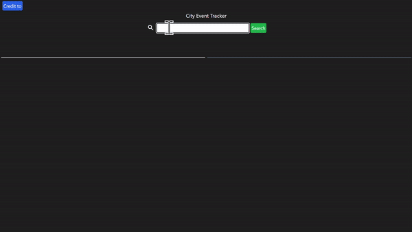

# city_eventtracker
A website built provide events in a city and the weather.

## Description
A site to find local weather and events in a given area. 

## Collaborators
jacobmrobison23 https://github.com/jacobmrobison23

Drew-Andersen https://github.com/Drew-Andersen

## How to Use
1. Open `https://djdevjams.github.io/city_eventtracker/` in your browser.
2. Enter a city and or state in the search bar.
3. Click the search button.

## Technologies Used
- HTML
- CSS
- JavaScript

## Mock-Up

----

Static site link - https://djdevjams.github.io/city_eventtracker/

Screenshot of site

----

## Testing
---
All links tested redirect to expected section on site. : Verified ✅

All text is ledgible. : Verified ✅
>
All images are visable and labed with alt text. : Verified ✅

The following image shows the web application's appearance and functionality:
![My Portfolio includes a navigation bar, a header image, and cards with text and images at the bottom of the page.]

Functionality:

